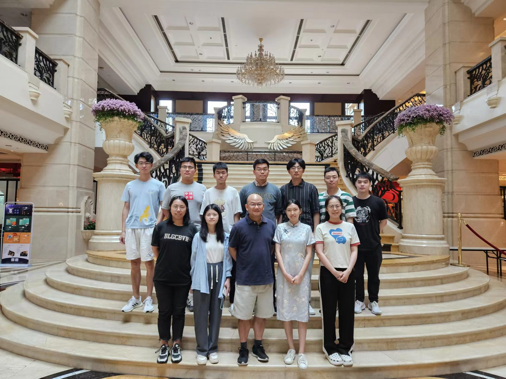

# **Join Us**

    

We are always looking for self-motivated [postdoctoral research associates](assets/pdf/Postdoc.pdf), [Ph.D. students](https://sse-mphil-phd.cuhk.edu.cn/program/CIE) and visiting master/Ph.D. students to join our team. The University and the Shenzhen Municipal Government offer highly competitive compensation. As of 2026/6, each postdoctoral research associate will receive an annual salary of no less than RMB 400,000 while each PhD student RMB 5,000 per month.

**Starting in the 2022–2023 academic year, all PhD students in our team will have reduced teaching duties. Whereas the standard TA requirement is five semesters, our PhD students now serve for only two or three semesters, depending on their prior degree, before the qualifying exam. Specifically, those enrolling with a master's degree will TA for two semesters, while those enrolling without will TA for three semesters.**

## **Contact Us**

:fontawesome-solid-map-location: **Address**: 419 Chengdao Building, 2001 Longxiang Road, Longgang District, Shenzhen, China

:fontawesome-solid-envelope: **E-mail**: simonpun[at]cuhk.edu.cn
