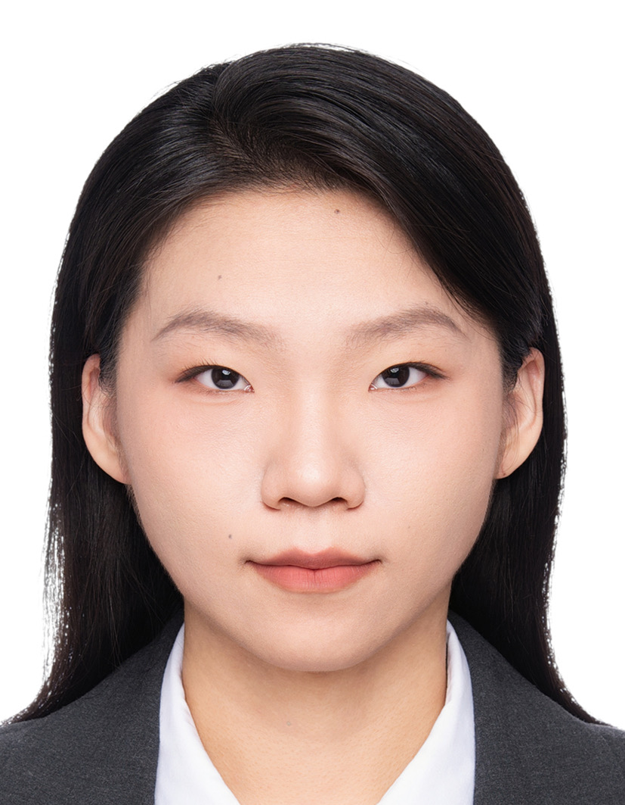

# **Members**

## **Principal Investigator**

    

        
    

    

        
<a href="../pi/" target="_self">Prof. Simon Pun</a>

        
Lab Director

        
Wireless Communications, IoT, Remote Sensing, Machine Learning

        
Mail: <a href="mailto:simonpun [at] cuhk.edu.cn">simonpun [at] cuhk.edu.cn</a>

    

## **Graduate Students**

    

        

            
        

        

            
<a href="https://scholar.google.com/citations?user=i5uLlWIAAAAJ&hl=en&oi=ao" target="_self">WANG Maonan</a>

            
Ph.D. Student

            
 本硕毕业院校：北京邮电大学

            
Reinforcement Learning, Intelligent Transportation System (ITS)

            
Mail: <a href="mailto:maonanwang [at] link.cuhk.edu.cn">maonanwang [at] link.cuhk.edu.cn</a>

        

    

    

        

            
        

        

            
<a href="https://scholar.google.com/citations?user=BiSmGpwAAAAJ&hl=en&oi=ao" target="_self">XIE Yujiao</a>

            
Ph.D. Student

            
 毕业院校：深圳大学（本科）, 香港中文大学（深圳）（硕士）

            
Reinforcement Learning, Machine learning, Communication networks

            
Mail: <a href="mailto:yuejiaoxie [at] cuhk.edu.cn">yuejiaoxie [at] cuhk.edu.cn</a>

        

    

    

        

            
        

        

            
<a href="https://scholar.google.com/citations?user=qXgwZswAAAAJ&hl=en&oi=ao" target="_self">WU Qianqian</a>

            
Ph.D. Student

            
 本硕毕业院校：中国地质大学（武汉）

            
Reinforcement learning, Location coverage problems, Sensor configuration

            
Mail: <a href="mailto:222010003 [at] link.cuhk.edu.cn">222010003 [at] link.cuhk.edu.cn</a>

        

    

    

        

            
        

        

            
<a href="https://scholar.google.com/citations?user=V_abVbEAAAAJ&hl=en&oi=sra" target="_self">MA Ding</a>

            
Ph.D. Student

            
 本科毕业院校：香港中文大学（深圳）

            
Remote Sensing, Machine Learning

            
Mail: <a href="mailto:119010229 [at] link.cuhk.edu.cn">119010229 [at] link.cuhk.edu.cn</a>

        

    

    

        

            
        

        

            
<a href="https://scholar.google.com/citations?user=b_aQODcAAAAJ&hl=en&scioq=ding+ma+cuhksz&oi=ao" target="_self">PANG Aoyu</a>

            
Ph.D. Student

            
 本科毕业院校：南京航空航天大学

            
Reinforcement Learning, Intelligent Transportation

            
Mail: <a href="mailto:aoyupang [at] link.cuhk.edu.cn">aoyupang [at] link.cuhk.edu.cn</a>

        

    

    

    

    
    

    

    	
<a href="https://scholar.google.com/citations?user=H5GQ1SYAAAAJ&hl=en&scioq=ding+ma+cuhksz&oi=sra" target="_self">WANG Ziyao</a>

    	
Ph.D. Student

    	
 本硕毕业院校：西安电子科技大学

    	
Remote Sensing, Cloud Removal, Machine Learning

    	
Mail: <a href="mailto:224010098 [at] link.cuhk.edu.cn">224010098 [at] link.cuhk.edu.cn</a>

    

    

    

    

    
    

    

    
<a href="https://scholar.google.com/citations?user=DIfYJRgAAAAJ&hl=en&oi=sra" target="_self">LUO Yixin</a>

    
Ph.D. Student

    
 毕业院校：西安电子科大（本科）, 中科院（硕士）

    
Remote Sensing, Change detection, Machine Learning

    
Mail: <a href="mailto:225010010 [at] link.cuhk.edu.cn">225010010 [at] link.cuhk.edu.cn</a>

    

    

    

    

    
    

    

    
<a href="https://scholar.google.com/citations?user=vKSQ2u4AAAAJ&hl=en&oi=sra" target="_self">WANG Ziyi</a>

    
Ph.D. Student

    
 毕业院校：武汉工程大学（本科）, 重庆大学（硕士）

    
Remote Sensing, Semantic Segmentation, Machine Learning

    
Mail: <a href="mailto:225010028 [at] link.cuhk.edu.cn">225010028 [at] link.cuhk.edu.cn</a>

    

    

    

    

    
    

    

    
<a href="https://scholar.google.com/citations?user=35tLJkoAAAAJ&hl=en&oi=ao" target="_self">ZHANG Hongyang</a>

    
Ph.D. Student

    
 毕业院校：云南大学（本科）, 厦门大学（硕士）

    
Remote Sensing, Geo-localization, Machine Learning

    
Mail: <a href="mailto:225010032 [at] link.cuhk.edu.cn">225010032 [at] link.cuhk.edu.cn</a>

    

    

	

	

	
	

	

	
<a href="" target="_self">WANG Sijin</a>

	
M.Phil. Student

	
 本科毕业院校：东北大学秦皇岛

	
Machine learning, IoT

	
Mail: <a href="mailto:224015101 [at] link.cuhk.edu.cn">224015101 [at] link.cuhk.edu.cn</a>

	

	

	

	

	
	

	

	
<a href="" target="_self">ZHOU Fangbing</a>

	
M.Phil. Student

	
 本科毕业院校：华南师范大学

	
Machine learning, Remote Sensing, Light pollution quantification

	
Mail: <a href="mailto:224015083 [at] link.cuhk.edu.cn">224015083 [at] link.cuhk.edu.cn</a>

	

	

		

	

	
	

	

	
<a href="" target="_self">MIAO Jifan</a>

	
MSc Student

	
 本科毕业院校：成都电子科大

	
Machine learning, Generative AI-based Synthetic Data Generation

	
Mail: <a href="mailto:jifanmiao [at] link.cuhk.edu.cn">jifanmiao [at] link.cuhk.edu.cn</a>

	

	

	
	

## **Undergraduate Students**
- SHEN Zhengyi
- WANG Hanwei
- HU Zeyun
- HE Yucheng
- LIU Yu
- LI Zhiheng
- YIN Hongrui
- YANG Hao (Visiting undergraduate student from 西北工业大学)
- LI Siwei (Visiting undergraduate student from 东北农业大学)
- YU Yinda (Visiting undergraduate student from 温州肯恩大学)

## **Alumni**
### **2025**
- Dr. MA Xianping （本科毕业院校：武汉大学）, Ph.D. student, First Job: Assistant Professor at the Southwest Jiaotong University, China
- XIE Weifeng （本科毕业院校：武汉大学）, M.Phil. student, First Job:  BYD (比亚迪)
- HU Yin, Research Assistant （本科毕业院校：香港中文大学（深圳）, 硕士毕业院校：Rice University, U.S.A.）, First Job: Ph.D. student at University of Wisconsin–Madison, U.S.A.
- LIN Kexin, Research Assistant （本硕毕业院校：北京交通大学）, First Job: Ph.D. student at 北京交通大学
- ZHENG Jingze, Undergraduate student, First Job: Ph.D. student at the Ohio State University, U.S.A.
- WU Yanrui, Undergraduate student, First Job: M.Phil. student at CUHKSZ
- LI Yutao, Undergraduate student, First Job: Master student at the University of California, San Diego (UCSD), U.S.A.
- WU Yueyan, Undergraduate student, First Job: Master student at the Carnegie Mellon University (CMU), U.S.A.
- KANG Zimo, Undergraduate student, First Job: Master student at the Chinese University of Hong Kong, Hong Kong, China
### **2024**
- SUI Jialu （本科毕业院校：山东大学威海）, M.Phil. student, First Job: Ph.D. student at the University of Hong Kong, Hong Kong, China
- LIANG Wendi （本科毕业院校：UIC）, M.Phil. student, First Job: Ph.D. student at the University of Electronic Science and Technology of China
- CUI Xiangyu （本科毕业院校：浙江大学）, M.Phil. student, First Job: HONOR (荣耀), Shenzhen
- SUN Yuchao （本科毕业院校：澳门科技大学）, M.Phil. student, First Job: BYD (比亚迪)
- CHEN Yanxi, Undergraduate student, First Job: Master student at the University of California, San Diego (UCSD), U.S.A.
- TANG Junzhe, Undergraduate student, First Job: Master student at the National University of Singapore (NUS)
- XIE Shanjun, Undergraduate student, First Job: Entrepreneur
- ZHANG Jiacheng, Undergraduate student, First Job: Entrepreneur
### **2023**
- Dr. SHAO Wei, Postdoc. Research Associate
- Dr. ZHANG Xiaokang, Postdoc. Fellow, Current Job: 副教授, 武汉大学
- LIU Zixiao （本科毕业院校：北京航空航天大学）, M.Phil. student, First Job: Texas Instruments (Beijing)
- FU Taimeng, Undergraduate student, First Job: Ph.D. student (Presidential fellow) at the State University of New York at Buffalo, U.S.A.
- MA Ding, Undergraduate student, First Job: Ph.D. student (Presidential fellow) at the Chinese University of Hong Kong, Shenzhen, China.
- HAN Jionghao, Undergraduate student, First Job: Master student at the Carnegie Mellon University (CMU), U.S.A.
- XU Zixiao, Undergraduate student, First Job: Master student at the Johns Hopkins University (JHU), U.S.A.
### **2022**
- YUAN Mingqi （本科毕业院校：中央民族大学）, M.Phil. student, Current Job: Ph.D. student at the Hong Kong Polytechnic University (PolyU)
- YU Weikang （本科毕业院校：北京航空航天大学）, M.Phil. student, Current Job: Ph.D. student at the Technical University of Munich (TUM)
- HU Yuxi （本科毕业院校：西北工业大学）, M.Phil. student, First Job: Ph.D. student at the Graz University of Technology, Austria
- ZHANG Boning （本科毕业院校：北京交通大学）, M.Phil. student, First Job: Ph.D. student at the University of Glasgow. Glasgow, Scotland, United Kingdom.
- LUO Shihao, （本科毕业院校：香港中文大学（深圳））, M.Phil. student, First Job: DJI (大疆)
- XU Yang, Undergraduate student, First Job: Ph.D. student at the Purdue University, U.S.A.
- LUO Wenyan, Undergraduate student, First Job: Ph.D. student at the Ohio State University, U.S.A.
### **2021**
- Dr. CAO Qi, Postdoc. Fellow, Current Job: Nokia (Hangzhou)
- Dr. NIU Guanchong, Ph.D. student, Current Job: (华山副教授) Associate Professor, Xidian University.
- ZHANG Qianyu, （本科毕业院校：东北大学秦皇岛）, M.Phil. student, First Job:
- ZHAO Tong, Master student, First Job: 京东
- WU Lan, Undergraduate student, First Job: Ph.D. student at the National University of Singapore (NUS)
- WANG Zewei, Undergraduate student, Current Job: Ph.D. student at the Chinese University of Hong Kong, Hong Kong, China.
- ZHANG Chi, Undergraduate student, First Job: Ph.D. student at the Chinese University of Hong Kong, Shenzhen.
- LI Ziwei, Undergraduate student, First Job: Master student at Rice University, U.S.A.
### **2020**
- Dr. GUO Sheng, Postdoc. Fellow, Current Job: (研究员) Research Fellow, 人工智能与数字经济广东省实验室（深圳）
- CHEN Yifei, Visiting Master student, First Job: 超星未来科技有限公司 (清华校企合作初创公司)
- LEI Ming, Master student, First Job: 腾讯
- XIE Yifei, Master student, First Job: Research Assistant at CUHKSZ
- TANG Jingjing, Undergraduate student, First Job: Ph.D. student at Queen Mary University of London, U.K.
- LUO Shihao, Undergraduate student, First Job: M.Phil. Student at CUHKSZ
- ZHANG Weilin, Undergraduate student, First Job: Master Student at Carnegie Mellon University, U.S.A.
- XIAO Ziheng, Undergraduate student, First Job: Master Student at Georgia Institute of Technology, U.S.A.

### **2019**
- YANG Nan, Visting master student, First Job: 随手记科技
- DU Jingxin, Undergraduate student, Current Job: Ph.D. student at the University of Wisconsin–Madison, U.S.A.
- WEI Yingxin, Undergraduate student, First Job: Graduate student at University of Minnesota, Twin Cities, U.S.A.
- LIU Yuanhao, Undergraduate student, First Job: Graduate student at University of Minnesota, Twin Cities, U.S.A.
### **2018**
- LU Yu, Master student, First Job: Ph.D. student at CUHKSZ
### **2017**
- LIU Wang, Master student, First Job: 大成基金管理有限公司
- HOU Xiaoye, Research Engineer, First Job: 草莓科技
- YANG Lujian, Research Engineer, First Job: 草莓科技